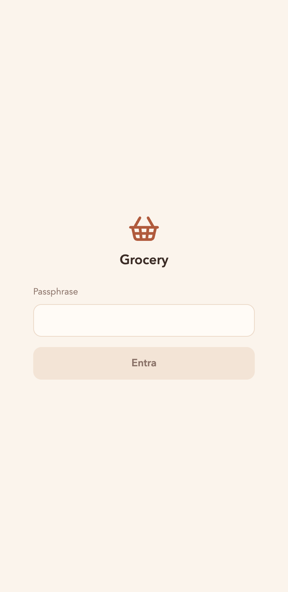
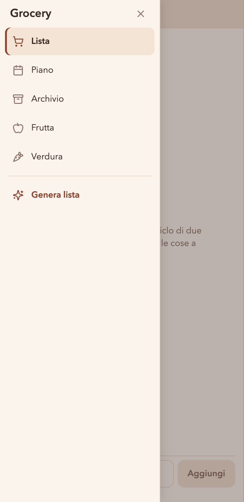
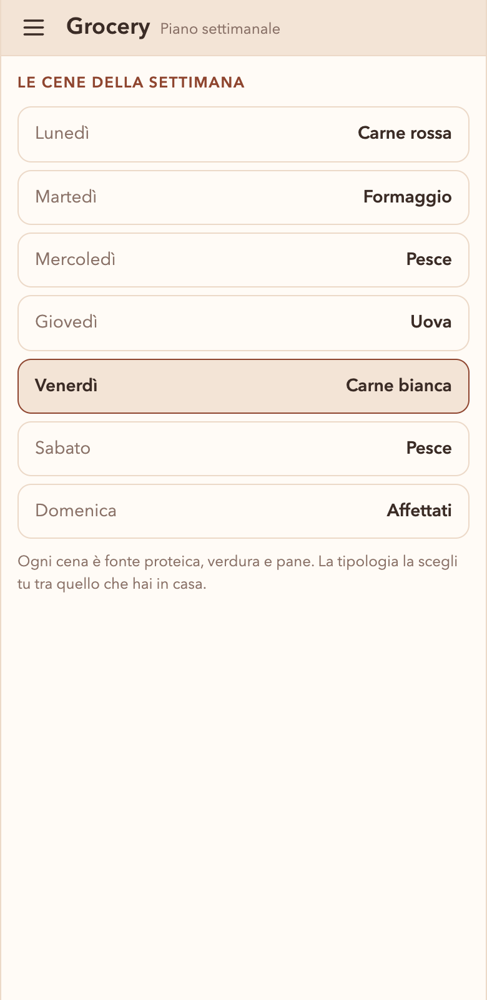
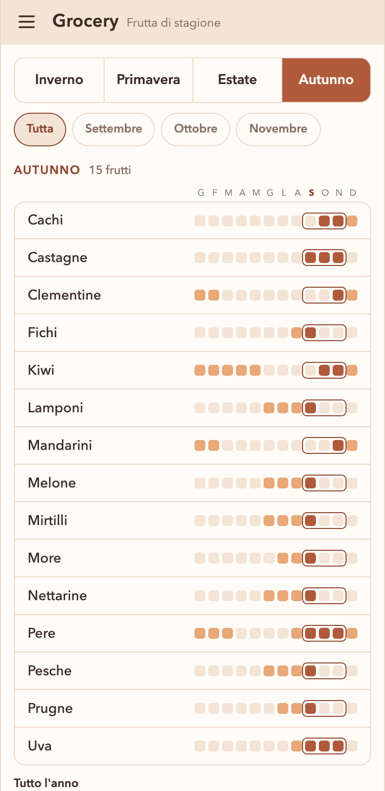

# Grocery

Tool personale per generare la lista della spesa di un ciclo di **due settimane** a
partire dalla routine alimentare seguita, e spuntarla al supermercato dal telefono.

<p>
  
  
  
  
</p>

- **Genera la lista** delle cene di due settimane: proteine pescate a caso dai
  cataloghi, senza ripetere quelle del ciclo prima, e frutta e verdura di stagione.
- **Divisa per reparto**, nell'ordine in cui si gira il supermercato; si spunta con
  un tocco e quello che è nel carrello sparisce.
- **Condivisa in tempo reale** tra due telefoni, dietro una passphrase.
- **Funziona senza rete**: è una PWA installabile, e le modifiche fatte offline
  partono quando la rete torna.
- Piano settimanale, archivio delle spese passate, frutta e verdura di stagione.

## Com'è fatta

- Frontend statico in **React + TypeScript + Vite**, pubblicato su **GitHub Pages**
  a ogni push su `main` ([workflow](.github/workflows/pubblica.yml)).
- Stato condiviso su **Supabase** (Postgres, realtime, policy per la sola sessione
  autenticata). Schema e funzioni in [supabase/migrations](supabase/migrations).
- Cataloghi, stagionalità e routine in **JSON versionato** ([src/data](src/data)):
  si aggiornano con un commit.
- Test con **Vitest**, soprattutto sull'algoritmo di generazione e sulla
  sincronizzazione offline.

📄 **La documentazione completa sta in [doc/](doc/README.md).**

## Sviluppo

```bash
cp .env.example .env.local   # URL, chiave publishable ed email del Supabase di sviluppo
npm install
npm run dev
npm test
```

Lo sviluppo gira su un progetto Supabase a parte (*Grocery DEV*), con lo stesso
schema: `npm run dev` non tocca i dati veri. Una migrazione nuova va applicata a
tutti e due i progetti.
